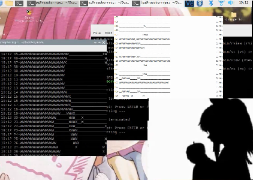

# bad-apple-dir
Bad Apple but... with folder names

# Bad Apple dataset
A simple dataset to run bad apple at a frame rate of 11 fps.
See how to use it [here](https://github.com/afmika/bad-apple-nodejs)
